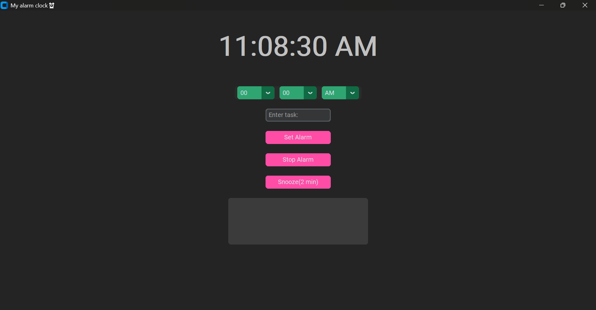

# Alarm Clock App

A simple GUI alarm clock built with Python.

## Features
- Set alarms with AM/PM
- Snooze (2 minutes)
- Stop alarm
- Add task/label to each alarm
- Sound notification using pygame

## Technologies Used 
- Python
- customtkinter
- pygame

  ## Preview

## Installation
pip install -r requirements.txt

## Run the App
python Alarm_clock.py
